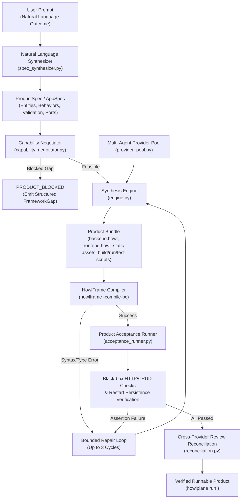

# Prompt-to-Product Synthesis: Architecture & Evaluation

## 1. Product North Star & Executive Summary

The primary objective of the Howl ecosystem is **not** to create another programming language for humans to manually author, format, and debug. 

The core product thesis is:
```text
    PROMPT
      ↓
    CREATE
      ↓
    VERIFY / REPAIR
      ↓
    USABLE PRODUCT
```
> *"Describe what you want. Howl creates it."*

While `.howl` source code, AST, and bytecode representations continue to exist internally as inspectable intermediate representations, audit/debug surfaces, and compilation targets, **manually writing `.howl` is no longer the primary product experience**.

HowlPlane acts as the orchestration and synthesis control plane (`howlplane create`, `howlplane run`, `howlplane dogfood`), translating user intent into verifiable software products that execute on top of HowlFrame's sandboxed virtual machine.

---

## 2. Synthesis Architecture



---

## 3. Core Subsystems

### 3.1 ProductSpec & AppSpec Definition (`src/control_plane/synthesis/product_spec.py`)
`ProductSpec` is the machine-checkable intermediate representation of a software product, capturing:
- **Interfaces**: `browser_ui`, `http_api`, `cli`, `module`.
- **Entities & Fields**: Field types (`string`, `int`, `float`, `bool`, `dict`, `list`), bounds, validation constraints.
- **Behaviors**: Endpoints, HTTP methods, CRUD operations, input/output contracts.
- **Persistence**: Scheme (`file://`, `memory://`, `none`), storage path, restart persistence invariants.
- **Acceptance Criteria**: Concrete, machine-checkable operational criteria (build, health probe, CRUD, validation rejection, restart persistence).

### 3.2 Natural Language Intent Synthesis (`src/control_plane/synthesis/spec_synthesizer.py`)
Converts unstructured human outcome descriptions into unambiguous `ProductSpec` models, automatically extracting entities, routes, validation rules, storage URIs, and default configurations without requiring the user to think in language constructs.

### 3.3 HowlFrame Capability Negotiation & Gap Detection (`src/control_plane/synthesis/capability_negotiator.py`)
Determines whether the requested product is feasible under HowlFrame's existing runtime capabilities (`network`, `database`, `filesystem`, `process`, `environment`).
When an infeasible capability is requested (such as atomic shared counter mutation across threads, raw websocket servers, external distributed SQL databases, or multi-threaded background workers), the negotiator halts synthesis immediately with `PRODUCT_BLOCKED` and emits a structured `FrameworkGap` object documenting:
- `code`: e.g. `HF_GAP_ATOMIC_MUTATION`, `HF_GAP_WEBSOCKET`, `HF_GAP_DISTRIBUTED_DB`, `HF_GAP_ASYNC_WORKER`.
- `required_behavior`: Specific missing capability requested by the prompt.
- `current_support`: Current HowlFrame runtime support status.
- `suggested_enhancement`: Actionable runtime/compiler enhancement to resolve the blocker.

### 3.4 Black-box Acceptance & Restart Persistence Runner (`src/control_plane/synthesis/acceptance_runner.py`)
Validates observable behavior without relying on internal unit tests:
1. **Compilation Check**: Executes `scripts/build.sh`, verifying clean lowering to bytecode (`backend.hfbc`).
2. **Static Asset Verification**: Confirms browser assets (`index.html`, `app.js`, `style.css`) exist and are non-empty.
3. **HTTP Health Probe**: Boots the application on an ephemeral port and probes `/health` or `/api/*`.
4. **CRUD REST API Verification**: Executes `POST` (create), `GET` (list), and invalid payloads to ensure `400 Bad Request` input validation rejection.
5. **Restart Persistence Check**: Creates records, terminates the server process, reboots the server, and asserts that data persisted across restarts in the file-backed store (`file://data/notes.json`).

### 3.5 Multi-Agent Provider Pool & Quota Routing (`src/control_plane/synthesis/provider_pool.py`)
Manages provider availability and task routing across `codex`, `agy`, `claude_code`, and `devin_cli`:
- **Exhaustion Signatures**: Pattern-matches rate limits (429), monthly/session quotas, and credit limits, transitioning providers to `RATE_LIMITED` or `SESSION_EXHAUSTED`.
- **Engineering Failure Differentiation**: Accurately distinguishes provider unavailability from normal engineering defects (compiler syntax errors, test failures, and reviewer findings feed into the bounded repair loop and do *not* mark providers as exhausted).
- **Avoid/Fallback Policy**: Reorders candidates when `--avoid-provider` or `--fallback-provider` is requested, placing the avoided provider last in priority while preserving fallback continuity.
- **Cross-Provider Review**: Enforces independent reviewer assignment so that the provider implementing a synthesis change is never the sole reviewer.

### 3.6 Marathon Dogfooding Engine (`src/control_plane/synthesis/marathon.py`)
Automates continuous batch synthesis across standardized benchmarks (`notes`, `todo`, `status_api`, `inventory`, `json_transform`), logging immutable audit entries into the `EvidenceLedger` (`.control_plane/evidence_ledger.jsonl`).

---

## 4. HFIR (HowlFrame Intermediate Representation) Architecture Evaluation

### 4.1 Current Architecture: AST vs HFIR Graph Transport
HowlFrame's current compilation pipeline lowers `.howl` S-expressions directly into an Abstract Syntax Tree (AST), performs type and capability checking, and generates either:
1. **HowlFrame Bytecode (`.hfbc`)**: Executed directly by the standalone VM with capability sandboxing (`-allow-caps network,database,filesystem`).
2. **Go Code (`gogen`)**: Lowered to Go source and compiled with `go build`.
3. **JavaScript (`javascript`)**: Transpiled for browser execution.

`internal/hfir/model_adapter.go` provides an experimental node-graph JSON transport for arithmetic and pure expressions up to 128 nodes (`maxCandidateNodes=128`, `maxTransportBytes=64KB`).

### 4.2 Trade-offs: Structured AST vs Graph-based HFIR for AI Synthesis
| Dimension | Structured AST / S-Expressions | Graph-based HFIR (`model_adapter.go`) |
| --- | --- | --- |
| **Expressiveness** | Covers fullstack applications, HTTP routing, native stores, static assets, error handling (`try_let`), and capability grants. | Limited to pure functional/arithmetic expressions; does not currently model top-level servers, file stores, or web apps. |
| **Token Efficiency** | Compact and directly readable; S-expressions allow dense representation of tree structures. | High overhead due to JSON graph node and edge dictionaries; hits 64KB transport ceiling rapidly. |
| **Synthesizer Reliability** | High when guided by `ProductSpec` templates; easily validated and repaired via compiler diagnostics (`line`, `column`, `reason`). | Complex to construct valid acyclic node references without dangling IDs. |
| **Sandboxing & Verification** | Capabilities enforced at runtime and statically checked via `internal/checker`. | Harder to audit capability boundaries across abstract graph nodes. |

### 4.3 Conclusion & Recommendation
For fullstack and CLI applications, the **`ProductSpec` -> AST / Bytecode** lowering pipeline is the most robust, maintainable, and expressive synthesis target. HFIR graph transport is suited for pure arithmetic optimizations and micro-kernel expression rewrites, but should not replace high-level application AST lowering for fullstack products.

---

## 5. Verification & Benchmark Evidence

Live synthesis benchmarks executed with `howlplane dogfood --max-iterations 5`:

| Benchmark | Output Directory | Checks Passed | Duration | Status |
| --- | --- | --- | --- | --- |
| `notes` | `output/dogfood_notes` | 8/8 | 0.242s | **VERIFIED** |
| `todo` | `output/dogfood_todo` | 8/8 | 0.346s | **VERIFIED** |
| `status_api` | `output/dogfood_status_api` | 6/6 | 0.315s | **VERIFIED** |
| `inventory` | `output/dogfood_inventory` | 8/8 | 0.340s | **VERIFIED** |
| `json_transform` | `output/dogfood_json_transform` | 6/6 | 0.306s | **VERIFIED** |

All products compile cleanly to `.hfbc` bytecode, boot successfully on ephemeral ports, handle REST CRUD operations, enforce input validation rules, and retain data across process restarts.
