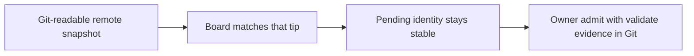

# 2026-09-29 Team HowlPlane Backlog

## Summary

Five seats polled the remote Factory loop after HOWL-011. The Engineering
Manager synthesis is a near-term build order of five steps, four unanimous
constraints, and two deferrals. This journal is the durable record. The five
steps are also Pending rows 70 through 74 in `improvements.md`, which is the
live ranked backlog `BacklogSource` already reads. The constraints and
deferrals are not rows.

This filing does not reopen HOWL-011. Plane pull request #123 is the landed
publish and Pending admit contract. Plane pull request #122 stays untouched.

## Context that the poll assumed

| Fact | Source in this checkout |
| --- | --- |
| Redacted publish exists: `howlplane factory status --publish` writes `factory/status/remote-snapshot.json` without starting a campaign and without taking the supervisor lock | `factory/REMOTE_OBSERVATION.md`, schema `howlplane.factory.status/v1` |
| Remote admit is one path: an exact `Pending` row in `issues.md`, `bugs.md`, or `improvements.md` | `factory/REMOTE_OBSERVATION.md`, `src/howlplane/control_plane/backlog_source.py` |
| Host publish of that snapshot is still the Owner's step on tallgeese. This checkout does not publish it | `factory/REMOTE_OBSERVATION.md` ("This checkout does not publish that snapshot.") |
| Board can project status and a Pending preview | Seat poll context. Board is not implemented in this repository |
| A missing snapshot means status is unknown. There is no `SNAPSHOT_ABSENT` token in the writer today | `factory/REMOTE_OBSERVATION.md`; `status_publish.py` has no such literal |
| `admit --from-pending` is not a command in this tree | CLI search on 2026-09-29 found no `from-pending` flag |

The CLI stays thin and JSON-first. Helpers that validate or format-check a
Pending row are allowed only as that one admit path. They are not a second
queue.

## Seats

| Seat | Role | What they asked to carry forward |
| --- | --- | --- |
| Motoko | Dev Lead | Schema lock, publish cadence, admit observability in the snapshot |
| Quatre | Product | Dogfood the remote loop, Board as the default surface, an admit contract Product can rely on |
| Hange | R&D | End-to-end proof on a live snapshot, thin Pending helpers, periodic freshness proof |
| Lain | Assurance | Pending-to-admit evidence lockstep, snapshot authenticity and tip-lock, a read-only probe surface |
| Heinrich | Auditor | A verifiable admit trail, read-path tip-lock, envelope binding deferred until that proof exists |

## Near-term build order

Row order in `improvements.md` is this sequence. Scores are recorded, and the
sequence outranks a pure score sort against the older library-hygiene rows
(61 through 69). Each step unblocks the next.

| Order | Row | Effort from the poll | What "done" means |
| --- | --- | --- | --- |
| 1 | 70 Host publish to E2E dogfood of the remote snapshot | S, once the Owner is home | Tallgeese commits `factory/status/remote-snapshot.json`. Board shows live status and Pending. One remote role runs validate/format-check as a dry-run. |
| 2 | 71 Lock the remote snapshot contract | S to M | Version, redaction, stale and absent (`SNAPSHOT_ABSENT`), tip SHA and path. Optional safe fields Board wants: campaign id, last-publish. |
| 3 | 72 Lock Pending admit evidence to the same identity | S to M | The same ids and schema from the Board preview through admit validate/format-check. Git can reconstruct who, which row, and the result. One admit path. No lock. |
| 4 | 73 Keep Board the default work surface on the locked contract | M | Campaign, blockers and `OWNER_REQUIRED`, Pending to mission. Mostly Board UX on the contract row 71 locks. |
| 5 | 74 Prove publish cadence and snapshot freshness | S for the ops note, M for the proof | Document the smoke. Optional `--arm-periodic` only after the supervisor is running the #123 code. |

### What unblocks first, after host publish

## Board and Plane ownership

Plane owns the snapshot contract, the redacted Git artifact, the single admit
path, and the supervisor. Board owns the work surface that projects those
facts: status, Pending preview, campaign, blockers, and the path from a
Pending row to a mission.

Row 73 does not ask this repository to grow a Board UI. Plane's obligation is
the locked read contract Board consumes. Building that surface inside
HowlPlane, or standing up a second Factory to feed it, is out of scope.

## Hard nos

These were unanimous. They are constraints on every row above. They are not
backlog rows.

1. No second Factory in the Grok cloud.
2. Bots never take the supervisor lock, start campaigns, or write trusted `owner_direction`.
3. Leave HowlPlane pull request #122 alone.
4. No parallel admit path outside thin CLI helpers. The executing path stays a ranked `Pending` row the existing `BacklogSource` reads.

`owner_direction` remains a host-trusted origin. A Git commit cannot mark
itself trusted. That rule is already in `factory/REMOTE_OBSERVATION.md`.

## Deferred

Not rows. Revisit only after the tip-lock end-to-end proof (rows 70 and 71)
exists.

| Deferral | Who asked | Why it waits |
| --- | --- | --- |
| Envelope and scope binding on admitted work | Heinrich (Auditor), cited as Auditor L | Bind the envelope after a Git-readable snapshot, a matching Board tip, and a stable Pending identity are proven |
| A richer ChangeOps and signature story | Poll deferral | The current admit trail is the ranked row plus Git evidence. Signatures are a later increment |

## What was filed

| Artifact | Path |
| --- | --- |
| This journal | `documentation/journals/2026-09-29_team_howlplane_backlog.md` |
| Pending rows 70 to 74 | `improvements.md` ranked backlog, in the order above |
| Changelog entry | `change_log.md` Unreleased |

No Factory, CLI, supervisor, or runtime code changed with this filing.

## Filing check

`BacklogSource` read `issues.md` and `improvements.md` from this checkout on
2026-09-29. Rows 70 through 74 are the first five eligible improvements, each
with status exactly `Pending`, a score at or above the 0.5 floor (4.0, 2.0,
2.0, 1.5, 1.0), and a detail section that includes deterministic acceptance.
No new row was excluded. Existing backlog tests build their own temporary
files, so this live parse is the check for the table shape. The full suite
was not required: no source, test, or CI file changed.
